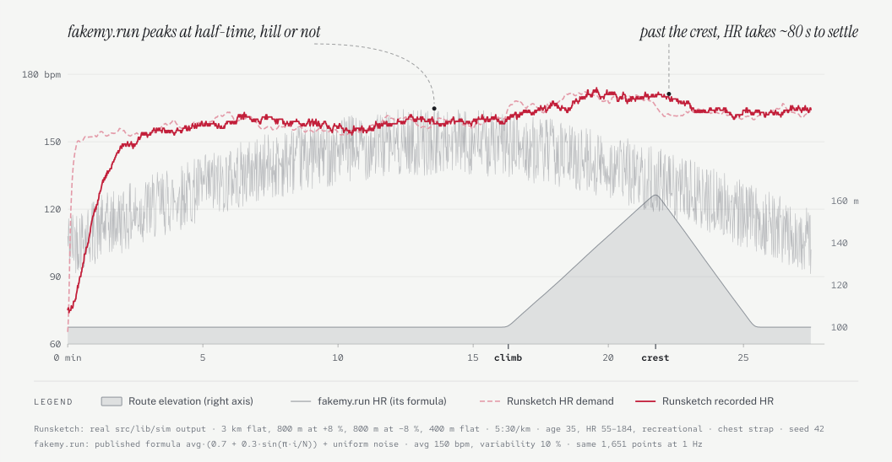
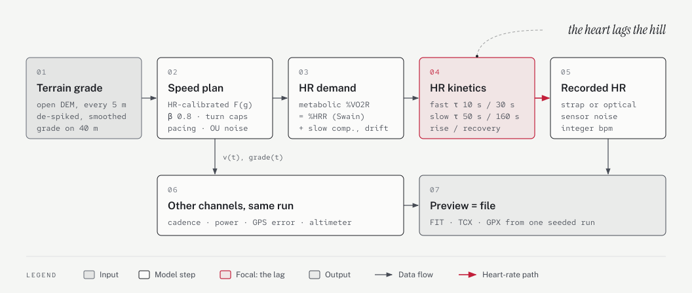
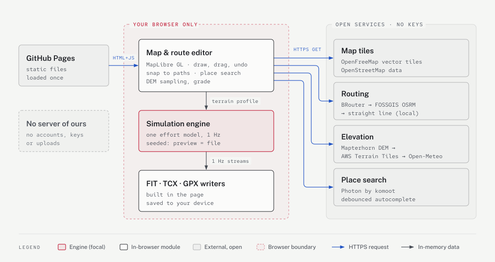

# Runsketch

[](https://yukij3.github.io/runsketch/)

**Draw a route on an open map, get an activity file whose heart rate climbs with the hills — and lags behind them like a real heart.**

Free, open-source, fully client-side. No account, no API keys, no tokens, no server of ours.

→ **https://yukij3.github.io/runsketch/**

[Русская версия ниже](#по-русски)

---

## Why

Tools like fakemy.run charge per file, and their heart rate is decoration: fakemy.run computes it as `avg · (0.7 + 0.3 · sin(π · i/N))` plus white noise — a hump indexed by point number, blind to terrain, with no physiological inertia. Pace gets per-segment white noise and ignores grade.

<picture>
  <source media="(prefers-color-scheme: dark)" srcset="docs/diagrams/hr-hill-dark.svg">
  
</picture>

<sub>Runsketch lines are real engine output: 3 km flat, 800 m at +8 %, 800 m at −8 %, 400 m flat, 5:30/km, recreational runner, chest strap, seed 42. Grey: fakemy.run's formula at its defaults (avg 150, variability 10 %) over the same 1,651 seconds.</sub>

Runsketch derives every channel from **one effort model**:

<picture>
  <source media="(prefers-color-scheme: dark)" srcset="docs/diagrams/effort-model-dark.svg">
  
</picture>

| | Runsketch | typical paid generator |
|---|---|---|
| Price | free, MIT | $0.40–0.80 per file or subscription |
| Pace on hills | HR-calibrated grade factor (Strava-GAP-like), partial effort compliance, downhill braking, power-hiking | constant pace + white noise |
| Heart rate | %HRR ≈ %VO₂R demand, asymmetric fast vagal + slow sympathetic kinetics (rise τ≈10 / 50 s, recovery 30 / 160 s), slow component, temperature-dependent cardiac drift, strap/optical noise | sine hump + random jitter |
| Cadence / power | coupled to speed and grade; Martin 1998 cycling power model | missing or random |
| GPS | correlated error (receiver lag, wandering bias, multipath) | none or white jitter |
| Elevation | open DEM sampled per point, de-spiked, smoothed | map-render dependent |
| Formats | FIT, TCX, GPX | GPX |
| Preview = file | yes, seeded | often no |

## Features

- Click-to-draw routes that follow paths (BRouter / FOSSGIS OSRM), drag to edit, undo/redo, loop, out-and-back, reverse, GPX/TCX import, place search.
- Run, ride, walk, hike. Athlete profile: age, sex, weight, height, resting and max HR, fitness level, HR sensor type.
- Target average pace, speed or finish time; even / negative / positive pacing; variability; stops; GPS noise; temperature; reproducible seed.
- Traces with one shared playhead: elevation and grade, pace, heart-rate **demand vs response** (the lag is visible), cadence.
- Laps and splits, calories, share link, English and Russian, metric and imperial.

## The model

Details and citations: [`docs/physiology.md`](docs/physiology.md). Short version:

- **Grade → speed.** Pace factor `F(g) = 0.0021g² + 0.034g + 1` (g in %), applied as `F^-0.8` so runners work a little harder uphill and ease off downhill; walking/hiking use Tobler's function; rides solve Martin et al. (1998) for speed from a power plan.
- **Demand.** Net VO₂ from Minetti et al. (2002) energy cost, `%HRR = %VO₂R` (Swain & Leutholtz 1997), HRmax `208 − 0.7·age` (Tanaka 2001).
- **Inertia.** Two parallel first-order parts, each slower to recover than to rise and scaled by fitness: a fast vagal part for the first 25 % of heart-rate reserve (τ 10 s up, 30 s down) and a slow sympathetic part above it (τ 50 s up, 160 s down); slow component above threshold; cardiac drift after ~12 min, faster in heat (Wingo 2005, Coyle & González-Alonso 2001).
- **Noise.** Ornstein–Uhlenbeck processes on log-speed (long-range correlated, not white), on HR and on GPS error.

<picture>
  <source media="(prefers-color-scheme: dark)" srcset="docs/diagrams/model-curves-dark.svg">
  
</picture>

<sub>Real engine output. Right: a recreational runner with resting heart rate 55 and maximum 185 bpm.</sub>

## Data sources

All reached directly from your browser. Please respect their fair-use policies.

<picture>
  <source media="(prefers-color-scheme: dark)" srcset="docs/diagrams/architecture-dark.svg">
  
</picture>

- Map tiles: [OpenFreeMap](https://openfreemap.org) © [OpenMapTiles](https://openmaptiles.org), data © [OpenStreetMap contributors](https://www.openstreetmap.org/copyright) (ODbL)
- Routing: [BRouter](https://brouter.de), [FOSSGIS OSRM](https://routing.openstreetmap.de)
- Elevation: [Mapterhorn](https://mapterhorn.com/attribution), fallback [AWS Terrain Tiles](https://registry.opendata.aws/terrain-tiles/), [Open-Meteo](https://open-meteo.com) (Copernicus GLO-90)
- Search: [Photon](https://photon.komoot.io) by komoot
- FIT encoding: [@markw65/fit-file-writer](https://github.com/markw65/fit-file-writer) (MIT)

## Development

```sh
npm ci
npm run dev        # http://localhost:5173
npm test           # vitest (XSD validation needs xmllint)
npm run build      # typecheck + production build
```

Pushing to `main` runs tests and deploys `dist/` to GitHub Pages (`.github/workflows/deploy.yml`).

---

## По-русски

**Нарисуйте маршрут на открытой карте и получите файл тренировки, в котором пульс растёт на подъёмах и отстаёт от нагрузки, как у настоящего сердца.**

Бесплатно, с открытым кодом, всё считается в браузере: без аккаунтов, ключей и токенов.

Зачем: платные генераторы (fakemy.run и аналоги) берут деньги за каждый файл, а пульс у них — синусоида с шумом, не зависящая ни от рельефа, ни от темпа. Здесь все каналы выводятся из одной модели усилия: уклон → скорость → метаболический запрос → пульс с физиологической инерцией (асимметричная кинетика, медленный компонент, кардиодрейф), плюс каденс, мощность, реалистичная погрешность GPS и высоты из открытой ЦМР.

- Маршрут по тропам и дорогам, перетаскивание точек, отмена, петля, туда-обратно, импорт GPX/TCX, поиск мест.
- Бег, велосипед, ходьба, хайкинг; профиль спортсмена; целевой темп, скорость или время; стратегия раскладки, остановки, шум GPS, температура, воспроизводимый seed.
- Графики с общим ползунком: высота и уклон, темп, пульс «запрос/ответ», каденс. Экспорт FIT, TCX, GPX.

## License

MIT
