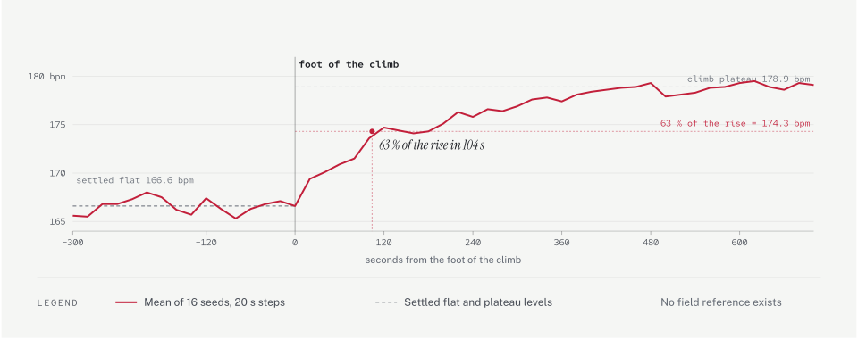

# Compared with other generators

[Physiology & motion models](physiology.md) explains how we decide how someone moves and how their heart responds, [Terrain](terrain.md) covers the ground under the route, and [What the watch records](recording.md) covers the file that comes out. This page is about a narrower question: when you put our output next to what other route-to-activity tools produce, and put both next to published field data, where do the numbers actually land?

Two things make that question answerable now. Field studies give real figures for how runners slow on hills, how heart rate lags effort, how much people fade over a marathon and how much heat costs. And two of the paid tools ship their generation code on a public page, commented, so their models can be read rather than guessed at. Where a tool is better than us, or equal, this page says so in the same words it uses where we come out ahead.

Every number in the "Runsketch" column comes from the engine at the commit this page was written against, measured with the scripts described under each row. Every number in a competitor column comes from reading that tool's own code. Reference numbers are from published papers, listed at the end.

## What is being compared

| # | What we measure | Reference | Runsketch | Best competitor |
|---|---|---|---|---|
| 1 | Speed on climbs, as a multiple of flat | Kay 2012 race records | 0.736 at +10 % | Fake My Stats 0.603 |
| 2 | Speed on descents, and the uphill/downhill asymmetry | Kay 2012 | 1.217 at −10 % (elite), ratio 2.28 | Dibma 1.176, flat beyond −10 % |
| 3 | Heart rate's response to a climb | no field reference | +12.3 bpm, 63 % of it in 104 s | Fake My Stats, Dibma, SimuRun all respond |
| 4 | Heart-rate lag to a step change | treadmill running fits | 50 s rising, 100 s recovering | Fake My Stats 28 s / 55 s |
| 5 | Cardiac drift over a marathon | Smyth 2022, 1.16 ± 0.22 | 1.134 | Dibma has a drift term |
| 6 | Pace decay over a marathon | Deaner 2015 | second half 4.25 % slower | Dibma has a fatigue term |
| 7 | Second-to-second pace texture | one decoded device file | 4.09 % / 0.941 / 0.047 m/s | none attempt it |
| 8 | Second-to-second heart-rate texture | one decoded device file | 0.610 bpm / 64.3 % / 1.988 bpm at a 61 s window | none attempt it |
| 9 | Stops at crossings | Highway Capacity Manual | 1.12 per km, mean wait 34 s | Dibma and Fake My Stats have stops |
| 10 | Response to heat | Mantzios 2022, Ely 2007 | +2.19 % at 25 °C, +9.4 bpm at fixed pace | none found |

Three of these rows are not scored against field data, and it would be misleading to present them as if they were. Row 3 has no published reference at all. The recovery half of row 4 has none either. Rows 7 and 8 are measured against a single decoded watch recording, one run on one device, which is a sanity check and not a population. Each of those rows says so again below.

## How we measured

Unless a row says otherwise: the default athlete (35, recreational, resting 55, maximum 184), a chest strap, a flat or synthetic profile from the scenario builders, and the seeds listed per row. Grade response is read straight off the model function, so no simulation is involved. Everything else is a simulation, averaged over several seeds where seed-to-seed noise would otherwise dominate. Mountain days and treks are excluded: those settings were being retuned when this was written.

The competitor figures are computed from their published code. Fake My Stats derives speed as `min(3.6 / runCost(grade), capMult)` with `capMult` of 1.40 or 1.28 depending on profile, where `runCost` is the Minetti polynomial. Dibma's `gradientResponse(g)` is a piecewise multiplier on pace, so speed is its reciprocal. SimuRun computes elapsed time as distance over one average speed, with no gradient term. fakemy.run computes segment time from haversine distance and a user pace, with no gradient term.

## Row 1 — speed on climbs

What we measure: the planned running speed on a constant grade, as a multiple of the same runner's flat speed. The reference is Kay's quartic fitted to the records of 91 uphill and 15 downhill hill races, which is the best-documented speed-versus-gradient curve we know of.

| grade | +2 % | +5 % | +8 % | +10 % | +15 % | +20 % |
|---|---|---|---|---|---|---|
| Kay 2012 records | 0.926 | 0.816 | 0.713 | 0.651 | 0.520 | 0.421 |
| Runsketch | 0.950 | 0.869 | 0.788 | 0.736 | 0.619 | 0.529 |
| Fake My Stats | 0.898 | 0.768 | 0.663 | 0.603 | 0.485 | 0.400 |
| Dibma | 0.962 | 0.862 | 0.763 | 0.719 | 0.667 | 0.667 |
| SimuRun, fakemy.run | 1.000 | 1.000 | 1.000 | 1.000 | 1.000 | 1.000 |

We are the fastest of the three modelled tools on climbs, and faster than the race records: 0.736 against 0.651 at +10 %, and 0.529 against 0.421 at +20 %. That is deliberate. Runners do not slow enough on hills to hold their effort level, which is what the exponent of 0.7 in the pace factor represents, and Townshend's runners bore that out with oxygen uptake rising from 89 % of their ventilatory threshold on the flat to 100 % on the climbs. But it is a modelling choice anchored to one study of eight runners, not a settled answer, and Kay's records are a different population running a different way.

Fake My Stats is the most conservative, because it takes speed directly from the energy cost as though effort were held exactly constant. Dibma's curve is reasonable to about +10 % and then stops: its multiplier caps at 1.50 on pace from +12 % upward, so a +20 % climb and a +12 % climb cost the same. The records say a +20 % climb costs about 2.4 times flat pace.

## Row 2 — speed on descents, and the asymmetry

The same measurement on negative grades, plus one derived number: how much a unit of uphill gradient costs in pace against how much a unit of downhill gradient gives back. Kay's steep-gradient fits give 1.818 s/m uphill against 0.8233 s/m downhill, a ratio of 2.21, so a climb costs about 2.2 times what the matching descent returns.

| grade | −5 % | −10 % | −15 % | −20 % | −25 % | −30 % |
|---|---|---|---|---|---|---|
| Kay 2012 records | 1.159 | 1.228 | 1.174 | 1.032 | 0.866 | 0.716 |
| Runsketch, elite | 1.154 | 1.217 | 1.159 | 1.017 | 0.853 | 0.708 |
| Runsketch, recreational | 1.124 | 1.156 | 1.063 | 0.897 | 0.731 | 0.603 |
| Fake My Stats | 1.314 | 1.400 | 1.400 | 1.400 | 1.400 | 1.400 |
| Dibma | 1.093 | 1.176 | 1.176 | 1.176 | 1.176 | 1.176 |

Our elite curve tracks the records within 0.015 the whole way down, and the asymmetry comes out at 2.28 against Kay's 2.21. The recreational curve sits below the records on purpose: descending fast on steep ground is a skill, and the spread between runners grows with steepness.

The difference worth naming is shape, not peak. Both modelled competitors saturate and stay saturated. Fake My Stats computes 1.67 at −10 % and 2.00 at −20 % from the cost curve, then clamps to 1.40, so its descents are capped at a plausible-looking number but the curve never turns back down. Dibma flattens at 1.176 from −10 %. Real descents turn over: past about −20 % runners brake, and by −30 % the records are slower than flat. A generator that stays at its cap is fastest exactly where a real runner is slowest.

<picture>
  <source media="(prefers-color-scheme: dark)" srcset="diagrams/comparison-grade-dark.svg">
  
</picture>

## Row 3 — heart rate's response to a climb

What we measure: a 6 km flat approach so heart rate is settled, then 2 km at +8 %, at 5:30/km with a chest strap. We take the mean over the five settled minutes before the climb, the mean over the last two minutes before the crest, and the time for the ensemble to cover 63 % of the difference. Sixteen seeds are aligned on the foot of the climb and averaged, then the timing is read once off the mean curve.

Settled flat heart rate is 166.6 bpm, the climb plateau is 178.9, so the rise is **12.3 bpm** and it takes **104 s** to cover 63 % of that.

Measuring this per seed does not work, and it is worth saying why. Heart rate wanders by a couple of beats on its own, so on any single run the 63 % threshold can be crossed immediately by a seed whose baseline happens to sit low. Across eight seeds we saw crossing times of 0, 6, 27, 63, 70, 91, 147 and 290 seconds — a spread that says nothing about physiology and everything about where the noise was sitting. Averaging the runs first and measuring once is the only estimate here we trust.

**There is no field reference for this row.** We could not find a study that measures how far behind a grade change heart rate runs for someone running outdoors on rolling ground. Figures quoted for it elsewhere trace back to coaching and vendor material rather than published measurement. So this row says what our engine does and what the other tools do; it does not say who is right.

What the others do: fakemy.run cannot respond at all, because its heart rate is a function of the trackpoint's index in the array, so a climb, a sprint and a stop all leave it unchanged. The other three do respond. Fake My Stats drives heart rate from power plus grade, SimuRun sums elevation change over a lagged window, and Dibma applies a lagged grade multiplier. On this row the gap is between fakemy.run and everyone else, not between us and them.

<picture>
  <source media="(prefers-color-scheme: dark)" srcset="diagrams/comparison-hr-climb-dark.svg">
  
</picture>

## Row 4 — heart-rate lag

Two different measurements, and they should not be confused.

Against an instantaneous step in demand, from 100 to 160 bpm and back, our heart rate covers 63 % of the rise in **50 s** and 63 % of the fall in **100 s**, a ratio of 2.0. Fitness scales both: a fitter athlete gives 38 s and 75 s, a less fit one 70 s and 140 s.

On an actual climb, where demand ramps in as the runner slows rather than stepping, the rise takes **104 s** — the row 3 figure. The step number is the model's own time constant; the hill number is what a reader would see in a file.

For the rising side there is a running reference. A treadmill study of eleven runners fitted a first-order time constant of 70.6 s and a better-fitting second-order pair of 18.6 s and 38.0 s. Our 50 s step response sits between those two fits. For the recovery side there is no running reference at all. The one study we found that timed both directions measured 36 women aged 35 to 55 in a clinical comparison, where healthy controls recovered about 2.9 times slower than they responded and a metabolic-syndrome group about 1.7 times. Those are not runners, and the paper states no ratio itself.

Fake My Stats uses a single pair for every transition, 28 s rising and 55 s recovering, a ratio of 1.96 against our 2.0. Both of us therefore recover faster than the one study that measured both directions. We are not more accurate here; we are more decomposed, splitting the fast vagal response from the slower sympathetic one so the effective ratio depends on the transition, 2.0 between efforts and 3.2 after a full stop. Whether that structure earns its complexity is exactly what this row cannot settle.

<picture>
  <source media="(prefers-color-scheme: dark)" srcset="diagrams/comparison-step-dark.svg">
  
</picture>

## Row 5 — cardiac drift

What we measure: a flat marathon at 6:00/km, four seeds. Following Smyth's definition, internal load is heart rate as a share of maximum, external load is speed, and the ratio of the two is indexed to the 5–10 km segment and compared with the last 5 km.

We come out at **1.134**, inside the 1.16 ± 0.22 measured across 82,303 recreational marathon runners. Over the race, heart rate rises from 147.7 bpm in the first 5 km to 164.0 in the last, while pace falls from 352 to 372 s/km.

Dibma is the only competitor with a term explicitly labelled cardiac drift, and it deserves the credit for having one. It is keyed to progress through the activity rather than to elapsed time, though: it begins at 25 % of the way through and reaches its maximum of +4 % at the end, so a thirty-minute run and a five-hour run drift by the same amount. Real drift depends on how long you have been going, not on how far through you are — in Fritzsche's measurements heart rate rose 11 % between minute 15 and minute 55 at a fixed workload.

## Row 6 — pace decay

The same marathon, comparing mean pace over the second half against the first.

Our second half is **4.25 % slower**. Published figures vary a great deal with the population: across 91,929 finishers of 14 US marathons the mean slowdown was 15.6 % for men and 11.7 % for women, but those means are pulled up by a long tail of large slowdowns, and smaller and better-paced samples give 5.7 ± 5.4 %. We sit at the well-paced end of that range rather than in the middle of it, which is worth knowing when reading our output: our default runner fades less than a typical marathon field does.

Of the competitors, Dibma again is the only one with a fatigue term, accumulating with climbing and adding a late multiplier in the last 20 % of the activity. Like its drift term it is keyed to fraction of the activity rather than to load or time. The others do not fade at all: a constant-speed generator scores exactly 0 % on this row, which is the single easiest thing to notice in a fabricated file.

<picture>
  <source media="(prefers-color-scheme: dark)" srcset="diagrams/comparison-marathon-dark.svg">
  
</picture>

## Row 7 — pace texture, second to second

Three statistics over the steady middle of a flat 10 km at 5:00/km, eight seeds: the spread of speed around its own one-minute average, how strongly one second's deviation predicts the next, and the spread of the change from one second to the next. We decoded the reference file ourselves rather than quoting figures from elsewhere, so both columns are computed the same way over the same window.

| | Recorded file | Runsketch |
|---|---|---|
| Speed around its 61 s average | 4.42 % | 4.09 % |
| Correlation with the previous second | 0.948 | 0.941 |
| Spread of the 1 s change | 0.048 m/s | 0.047 m/s |

**The reference is one file.** It is a 47-minute, 9 km run recorded every second on a Garmin fēnix 2 with a chest strap, and matching it closely is a sanity check, not evidence that we match runners in general. A single recording on a decade-old single-band watch cannot tell us what the distribution looks like. We would like a set of current multi-band recordings on known routes to replace it.

No competitor attempts this. The closest is fakemy.run, which applies independent random noise per segment; independent noise gives a correlation with the previous second near zero, where this recording sits at 0.95. That difference is visible in any plot of a file.

<picture>
  <source media="(prefers-color-scheme: dark)" srcset="diagrams/comparison-speed-texture-dark.svg">
  
</picture>

## Row 8 — heart-rate texture, second to second

The same run, the same window, for the strap trace.

| | Recorded file | Runsketch |
|---|---|---|
| Spread of the 1 s change | 0.612 bpm | 0.610 bpm |
| Seconds with no change | 63.8 % | 64.3 % |
| Spread around the 61 s average | 1.496 bpm | 1.988 bpm |

The first two land on the reference almost exactly. The third does not, and it is worth being precise about why, because the obvious way to state it is wrong.

The spread around a moving average depends steeply on how wide that average is. On this same file it runs 0.947 bpm at a 31 s window, 1.496 at 61 s, 2.442 at 121 s and 3.371 at 181 s, so it more than triples across that range. A single figure for it means nothing unless the window is given with it. Measured like for like, our heart rate wanders about a third more than the file's at 61 s, 1.988 against 1.496, and again at 121 s, 3.244 against 2.442. So our minute-scale wander is larger than the real file's, not smaller.

Speed runs the other way and by less: ours sits at about nine tenths of the file at every window we tried.

The same caveat as row 7 applies: this is one recording, and the same caveat about competitors applies too — none of them models sample texture, and fakemy.run's independent per-point noise at ±15 bpm produces a jagged band that nothing in a real trace resembles.

<picture>
  <source media="(prefers-color-scheme: dark)" srcset="diagrams/comparison-hr-texture-dark.svg">
  
</picture>

## Row 9 — stops

What we measure: a flat 10 km at 5:00/km with the urban stop setting, six seeds, counting every halt and its length.

We stop **1.12 times per kilometre**, with a mean wait of **34 s**, a median of 30 s, and 28 % of waits longer than 45 s. The reference is the pedestrian delay model in the Highway Capacity Manual, which for a signal cycle of 60–120 s and a walk phase of 10–30 s implies stopping at about 78 % of crossings and waiting a mean of 35 s. With a crossing every 400–900 m that works out at about 1.20 stops per kilometre, so we stop slightly less often and for slightly less time than the model implies.

Dibma and Fake My Stats both have stops, and Fake My Stats places roughly one per 8 km with a dwell of 20 to 120 s. Neither appears to write timer events into the file, which is the part that matters for how a platform computes moving time; ours are written as auto-pause events with the timer stopping and starting, as [What the watch records](recording.md) describes.

<picture>
  <source media="(prefers-color-scheme: dark)" srcset="diagrams/comparison-texture-dark.svg">
  
</picture>

## Row 10 — heat

What we measure: a flat 10 km solved at a fixed effort preset, sweeping air temperature away from the neutral baseline of 15 °C, 60 % humidity, calm and dry.

| | 20 °C | 25 °C | 30 °C | 32 °C | 35 °C |
|---|---|---|---|---|---|
| Moving time, steady effort | +1.67 % | +2.19 % | +3.04 % | +3.46 % | +4.28 % |

The published slope is −0.3 to −0.4 % per °C of wet-bulb globe temperature outside a band of 7.5–15 °C, and the top men in seven marathons were 1.7, 2.5, 3.3 and 4.5 % slower than the course record across rising WBGT quartiles. Our curve is the same order and shape. Three honest qualifications. The loss depends on which effort preset is being solved, running from 2.19 to 2.52 % at 25 °C across easy, steady, tempo and race. A half marathon loses more than a 10 km at every preset, 2.79 % against 2.19 % at 25 °C for steady effort, which is the right direction: heat costs more the longer you are out in it. And at 35 °C the tempo and race presets jump to 7.4 and 8.9 %, and to about 13.7 % over a half marathon, which looks like the solver running into what is sustainable rather than a smooth physiological curve, so we would not draw that end of the range as though it were one.

Below 15 °C the loss is exactly zero: we model no cold penalty at all. The published curve is a shallow U with an optimum between about 4 and 10 °C and losses on both sides, so our flat cold side is a simplification rather than a match.

Heat reaches heart rate as well as pace. At a fixed pace of 5:30/km, where the target is honoured exactly and moving time does not change, mean heart rate goes from 155.4 bpm at 15 °C to **164.8 at 32 °C** — the same run costing 9.4 more beats per minute. We found no competitor that models temperature at all.

<picture>
  <source media="(prefers-color-scheme: dark)" srcset="diagrams/comparison-heat-dark.svg">
  
</picture>

## What this page does not settle

- Row 3 and the recovery half of row 4 have no field reference. We report what the engine does and leave it there.
- Rows 7 and 8 are measured against a single watch recording. They show we are not obviously wrong; they cannot show we are right.
- Our climbs are faster than race records by design, resting on one study of eight runners.
- Our default runner fades less over a marathon than a typical field does.
- We model no cold penalty.
- Our minute-scale heart-rate wander is about a third larger than the one real file we have, at every averaging window we tried, while our speed wander is about a tenth smaller.
- The competitor figures are computed from code we read, not from files we generated. We did not buy, sign up for or upload anything, so we have not checked that their output matches their own source.

## References

Hills and pace

- Kay A. Pace and critical gradient for hill runners: an analysis of race records. *J Quant Anal Sports* 8(4), 2012. https://doi.org/10.1515/1559-0410.1456
- Minetti AE, Moia C, Roi GS, Susta D, Ferretti G. Energy cost of walking and running at extreme uphill and downhill slopes. *J Appl Physiol* 93:1039–1046, 2002. https://pubmed.ncbi.nlm.nih.gov/12183501/
- Townshend AD, Worringham CJ, Stewart IB. Spontaneous pacing during overground hill running. *Med Sci Sports Exerc* 42:160–169, 2010. https://pubmed.ncbi.nlm.nih.gov/20010117/

Heart rate

- Heart-rate kinetics on a treadmill, first- and second-order models. https://pmc.ncbi.nlm.nih.gov/articles/PMC8059023/
- On- and off-transient heart-rate kinetics. https://pmc.ncbi.nlm.nih.gov/articles/PMC5526966/
- Fritzsche RG, Switzer TW, Hodgkinson BJ, Coyle EF. Stroke volume decline during prolonged exercise is influenced by the increase in heart rate. *J Appl Physiol* 86:799–805, 1999. https://pubmed.ncbi.nlm.nih.gov/10066688/
- Coyle EF, González-Alonso J. Cardiovascular drift during prolonged exercise: new perspectives. *Exerc Sport Sci Rev* 29:88–92, 2001. https://pubmed.ncbi.nlm.nih.gov/11337829/

Fatigue and pacing

- Smyth B, Maunder E, Meyler S, Hunter B, Muniz-Pumares D. Decoupling of internal and external workload during a marathon. *Sports Med* 52:2283–2295, 2022. https://pmc.ncbi.nlm.nih.gov/articles/PMC9388405/
- Deaner RO, Carter RE, Joyner MJ, Hunter SK. Men are more likely than women to slow in the marathon. *Med Sci Sports Exerc* 47:607–616, 2015. https://pubmed.ncbi.nlm.nih.gov/25051390/

Heat

- Ely MR, Cheuvront SN, Roberts WO, Montain SJ. Impact of weather on marathon-running performance. *Med Sci Sports Exerc* 39:487–493, 2007. https://pubmed.ncbi.nlm.nih.gov/17473775/
- Mantzios K et al. Effects of weather parameters on endurance running performance. *Med Sci Sports Exerc* 54:153–161, 2022. https://pubmed.ncbi.nlm.nih.gov/34334722/
- El Helou N et al. Impact of environmental parameters on marathon running performance. *PLoS ONE* 7:e37407, 2012. https://pubmed.ncbi.nlm.nih.gov/22649525/

Stops

- Transportation Research Board. *Highway Capacity Manual 2010*, pedestrian delay at signalised intersections, p. 18-69.

Tools read

- fakemy.run, generation code in the page bundle at `/_next/static/chunks/app/create/`.
- Fake My Stats, generation code inline at https://fakemystats.com/run
- Dibma, generation code inline at https://dibma.com/activity/create
- SimuRun, generation code in the application bundle at https://app.simurun.com/
- gpx.studio, https://github.com/gpxstudio/gpx.studio
